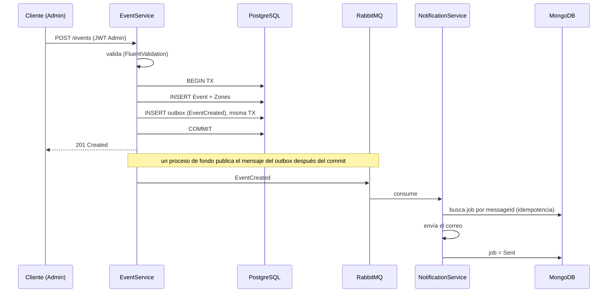

# Arquitectura

Con el tiempo que tuve me concentré en dejar andando los dos servicios que pedía el enunciado
(EventService y NotificationService) y en que la comunicación entre ellos fuera por eventos y
no acoplada.

## Decisiones

- **.NET 9, arquitectura en capas.** Domain / Application / Infrastructure / Api, para que las
  reglas de negocio no dependan de EF ni de MassTransit.
- **Mensajería con RabbitMQ vía MassTransit.** MassTransit abstrae el transporte, así que el
  mismo código serviría con SNS/SQS en AWS cambiando configuración. Usé RabbitMQ para que todo
  corra en docker-compose sin cuenta cloud.
- **PostgreSQL para EventService.** `Event` y `Zone` tienen integridad referencial y se crean
  de forma atómica dentro de una transacción.
- **MongoDB para NotificationService.** Es un log de notificaciones: mucha escritura, sin
  joins, y el contenido puede variar por canal (hoy email, mañana SMS o push). Documentos
  encajan mejor que un esquema fijo.
- **Redis** para cachear `GET /events`, que es la lectura más frecuente.
- **JWT propio (HS256)** para el MVP. En producción sería OIDC contra un IdP (Cognito/Keycloak),
  validando RS256 con el JWKS, sin cambiar el resto del pipeline de autorización.

## Flujo: crear un evento

## Resiliencia

- **Outbox transaccional** en EventService: el mensaje se guarda junto con el evento en la
  misma transacción, no se pierde si el broker está caído.
- **Retry con backoff + DLQ** en NotificationService (MassTransit). El job además queda en
  `Failed` para poder verlo sin mirar colas.
- **Idempotencia del consumer** apoyada en el estado `Sent`.
- **Rate limiting** por IP en la API.
